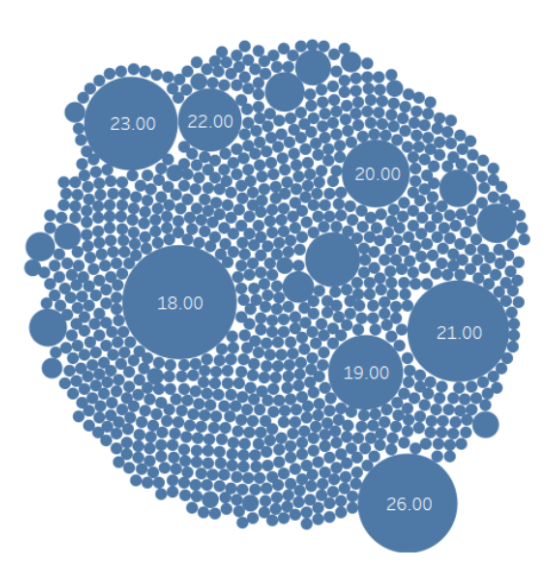
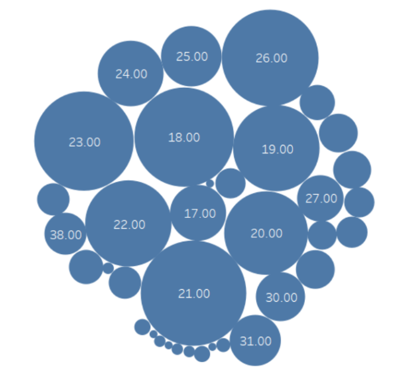
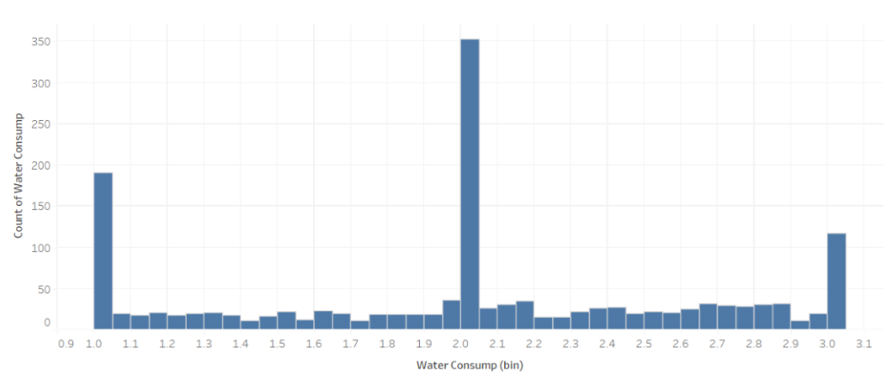
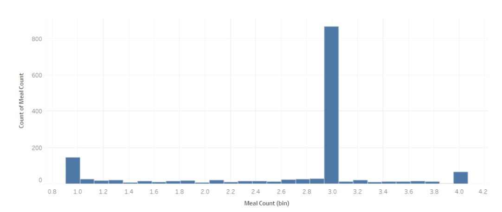
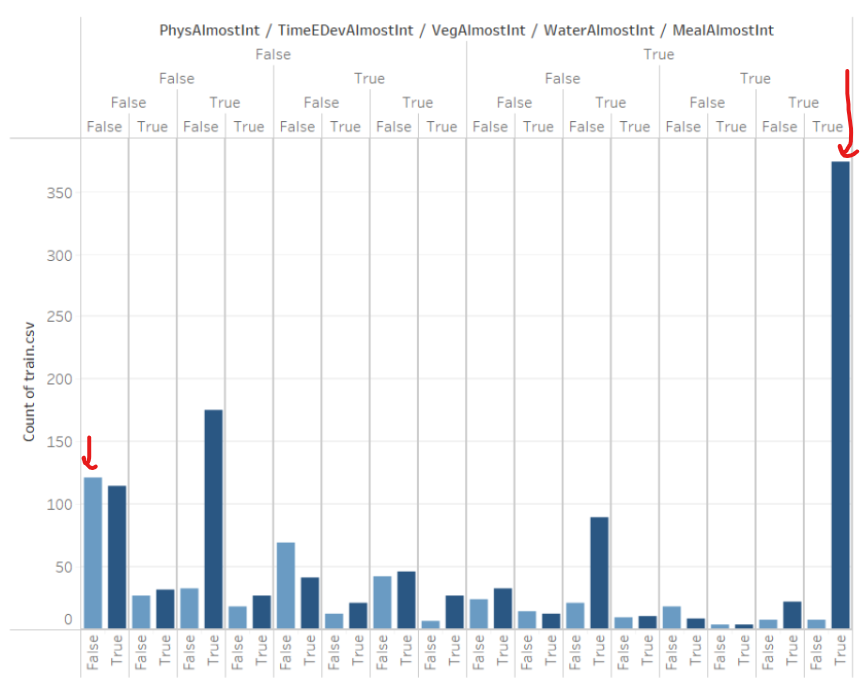
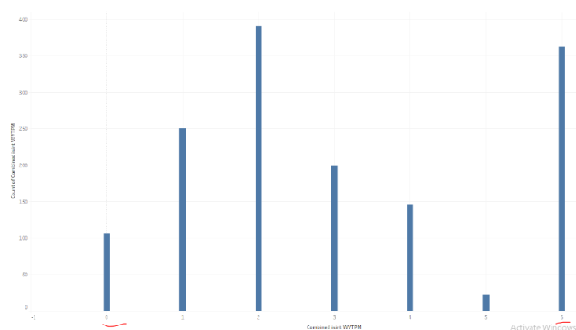

# Human Body Level Classification
## Table of Contents

- [Introduction](#introduction)
- [Data Exploration](#data-exploration)
- [Preprocessing](#preprocessing)
- [Feature Engineering](#feature-engineering)
- [Training &amp; Results](#training--results)
- [Final Choice &amp; Conclusions](#final-choice--conclusions)

## Introduction

This project analyzes the data of human body-level classification. The data is collected from `1477` people and contains `16` attributes. The goal is to predict the body level of a person based on the attributes and classify the person into one of the four classes: Body Level **1**, Body Level **2**, Body Level **3**, and Body Level **4**. Data attributes are described in the table below.

| Attribute                 | Description                                           |
| -----------------------   | ----------------------------------------------------- |
| `Gender`                  | Male or Female                                        |
| `Age               `      | Numeric value                                         |
| `Height            `      | Numeric value (in meters)                             |
| `Weight            `      | Numeric value (in kilograms)                          |
| `Fam_Hist          `      | Does the family have a history with obesity?          |
| `H_Cal_Consump     `      | High caloric food consumption                         |
| `Veg_Consump       `      | Frequency of vegetables consumption                   |
| `Meal_Count        `      | Average number of meals per day                       |
| `Food_Between_Meals`      | Frequency of eating between meals                     |
| `Smoking           `      | Is the person smoking?                                |
| `Water_Consump     `      | Frequency of water consumption                        |
| `H_Cal_Burn        `      | Does the body have high calories burn rate?           |
| `Phys_Act          `      | How often does the person do physical activities?     |
| `Time_E_Dev        `      | How much time does person spend on electronic devices |
| `Alcohol_Consump   `      | Frequency of alcohols consumption                     |
| `Transport         `      | Which transports does the person usually use?         |
| ***Body_Level***          | Class of human body level                             |

We tried different concepts from the college machine learning course on this data and compared the results to find the best model. Note that the project was a competition between 21 teams. The competition was based on the weighted f1-score on the test set. The test set was not provided to us, so we had to submit our chosen model as a script to be tested by the TA.

Fortunately, we were able to achieve the **highest score in the competition and get the 1st place**. The final f1-score of our model on the test data was **0.998**.

## Data Exploration

We used Tableau and also Python Matplotlib and Seaborn libraries to visualize the data and explore it throughout the project.

 

Figure 1: Age Most Frequent Values - Left: Before Rounding, Right: After Rounding

We started by exploring each variable independently. For Example, we plotted the distribution of the `age` variable and found that the majority of the data is for ages ranging from 18 to 26. We also found that some values were `float`s, like a value of `18.173` for the age variable. Surely, it could mean that the person is `18 + 173/1000 of a year old`, but it’s not a common way to represent `age`.

So we decided to round the values of the `age` variable. The distribution after rounding looked much better as shown in Figure 1. This was important because the majority of the data was integer values and we wanted to keep the data consistent.

The fact that some values were float while some others were exact integers was a bit suspicious. We then investigated the remaining variables and found an interesting pattern in the data.

#### Integer Values Pattern

Figure 2: Histograms of 2 variables: Water Consumption, Meal Count

We can see that these variables range from 0 to 4, but with spikes at the integer values, while the distribution for remaining non-integer values is almost uniform and small in comparison to the integer values. Depending on the collection method, it can be argued if this is a valid pattern or not. Take the Meal Count variable for example, if it is collected once via a form, then surely it wouldn't make sense that people would enter 2.35531314 as a value for example.

However, if data was collected regularly, then it can be argued that the person might have eaten 2.35531314 meals on **average** per day. Even in that case, it is still weird that the distribution is not uniform and has spikes at the integer values. This pattern showed up in at least 6 variables: **Water Consumption, Veg Consumption, Time E Dev, Meal Count, Weight, and Phys Act.** We tried to investigate the correlation between them to see if the non-integer occurrences or lack thereof are correlated.

#### Testing Correlation & Speculations

Figure 3: Correlation between the 6 variables

Left: We can see the combinations of each variable being integer (True) or not (False). Right: a summarized version where we plot only the count of rows having a specific number of variables being integers (0-6)

These Graphs were very interesting for a couple of reasons:
- For most of the variables, The times when that specific variable is an integer is very close to 50%. So if there was no correlation between the variables, then each combination of the 6 variables being integer or not should have a similar frequency. However, the first graph shows some combinations are far more frequent than others.

- Further, the most frequent combination is where all variables are integers. This is interesting as it means that if one of the variables is an integer, then the probability of the remaining variables being integers is very high. To put this into perspective: if there was no correlation between the variables, then the probability of all variables being integers is `0.5^6 = 1.56%`. However, here it is **more than 25%**. This is a very strong correlation.

- The second graph shows an interesting asymmetry, if there was no correlation between the variables, the distribution of the number of variables being integer should be a binomial distribution. In other words, we would see a symmetric bell curve centered around 3. However, the curve seems heavily skewed to the left (except for "at 6" as discussed above). We can see that values of 0, 1, and 2 are much more frequent than 3, 4, and 5 respectively.

- Following this pattern, we deduce the variables tend to be `float` together (to a lesser extent). For example, the combination of 0 or just 1 variable being integer is high compared to what we would expect if there was no correlation. For example, the probability should be ~10% but it is > 25% in the data.

 

Based on the patterns and what we discussed earlier about data collection, we speculate that the values of these columns were originally supposed to be integers, but some of them were missing frequently. These values were then imputed through interpolation or other methods. This is what introduced `float` values. Of course, this is just a speculation and we don’t have concrete proof for it. But the strong correlation between the existence of `float` values or lack thereof in the columns is a strong supporting observation.

These observations might seem irrelevant to the project, or a bit reaching, but they were actually useful in the end. We will discuss this in the following sections. we also tried some other visualizations but didn’t find anything else interesting.

